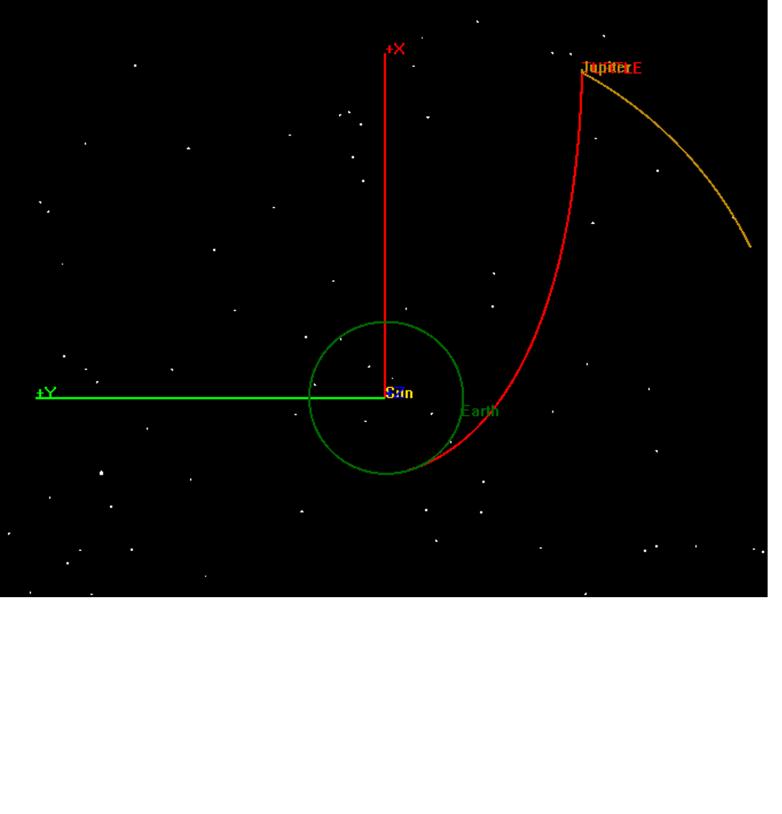
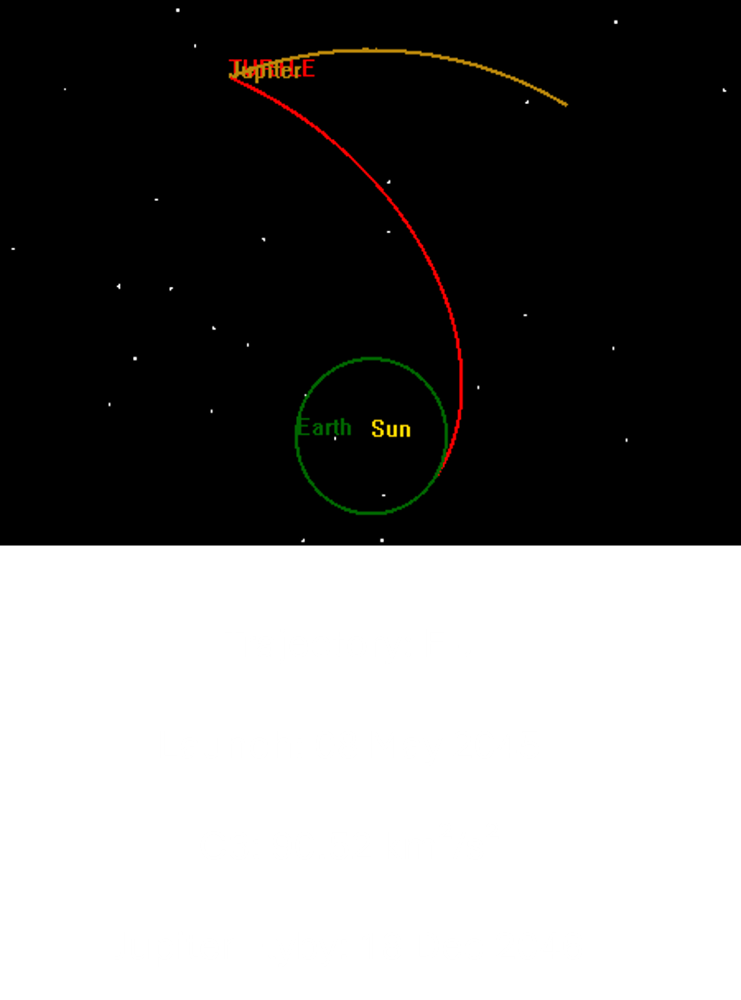

# Interstellar Probe Trajectory Design

[](https://www.python.org/) 
[](https://gmatcentral.org) 
[](https://esa.github.io/pykep/)

A mission design study for an **Interstellar Probe** using gravity assists and trajectory optimization.  
This project demonstrates advanced astrodynamics techniques, including **Lambert solvers, patched flybys, trajectory optimization with PyGMO, and GMAT**.

---

## 🌌 Problem Statement
Design a trajectory for a probe to exit the heliosphere (90–200 AU) using planetary flybys.  
Two trajectory families were explored:
1. **Earth → Jupiter** direct flyby  
2. **Earth → Venus → Jupiter** sequence
3. **Earth → Venus → Earth → Jupiter** Sequence

---

## 🛠 Tools & Methods
- **Astrodynamics libraries:** PyKEP, PyGMO, SPICE
- **Mission analysis software:** GMAT
- **Programming:** Python
- **Techniques:**  
  - Lambert solver for interplanetary transfers  
  - Jupiter flyby using patched conics approximation (turning angle, v∞ analysis, flyby periapsis radius)  
  - Delta v optimization of Earth-Venus-Jupiter trajectory using PyGMO.  
  - Validation for Lambert solver using New Horizons and PyGMO using Cassini.  

---

## 📊 Results
- **Launch:** 2045-05-08 (C3 = 90.52 km²/s²)  
- **Jupiter flyby:** 2046-12-18, turning angle = 56.72°, v∞ = 8.99 km/s  
- **Exit speed after Jupiter:** 20.12 km/s  
- **Mission durations:**  
  - 90 AU → 20.43 years  
  - 120 AU → 27.37 years  
  - 200 AU → 45.97 years  
  - **Total (Earth → 200 AU): ~45.97 years**

---

## 📂 Repository Structure
Interstellar-Probe/<br>
│
├── notebooks/         # Jupyter notebooks for trajectory design & analysis<br>
├── scripts/           # Python scripts for Lambert arcs, flyby dynamics<br>
├── results/           # Plots, output data, mission timelines<br>
├── requirements.txt   # Python dependencies<br>
└── README.md          # Project overview (this file)<br>


---

## 📸 Plots
**EARTH → JUPITER (C3>100)**
<p align="center">
  
  
</p>

<br>

**EARTH → JUPITER (C3<100)**
<p align="center">
  
  
  
</p>

<br>

**EARTH → VENUS**
<p align = "center">
 <br>
  <em>An Earth-Venus Lambert arc in GMAT</em>
</p>

<br>

**EARTH → VENUS → JUPITER PATCHED**
<p align = "center"> 
 <br>
  <em>The Original Earth-Venus trajectory patched with a Venus Jupiter trajectory to give a complete Earth-Venus-Jupiter trajectory</em>
</p>

<br>

**EARTH → JUPITER → HELIOPAUSE**
<p align = "center"> 
 <br>
  <em>Complete Trajectory from Earth to Heliopause (120 AU) using a Jupiter flyby in GMAT</em>
</p>

---

## 🚀 Future Work
- Complete **optimized trajectory** to the Heliopause/ISM using models  

---

## 📖 References
- Cassini Trajectory & New Horizons Validation  
- JPL Horizons Data for planetary positions  
- ESA PyKEP & GMAT documentation  

---

## 👤 Author
**Manas Karnik**  
M.Sc. Space Exploration Systems, University of Leicester (2024–2025)  
- [LinkedIn](https://www.linkedin.com/in/manaskarnik)  
- [Medium Blog](https://manaskarnik.medium.com)  
- [Email](mailto:manaskarnik09@gmail.com)

---

## 🛰 How to Run
Clone and install dependencies:
```bash
git clone https://github.com/manaskarnik09/Interstellar-Probe
cd Interstellar-Probe
conda create -n PyKep python=3.10 # Only for the first time
conda activate PyKep
conda install pykep
conda install pygmo
conda install pygmo plugins non_free
conda install jupyter notebook
conda install matplotlib
jupyter notebook
#Open and run notebook from the /notebook folder eg: Jupiter Optimal Trajectories.ipynb

